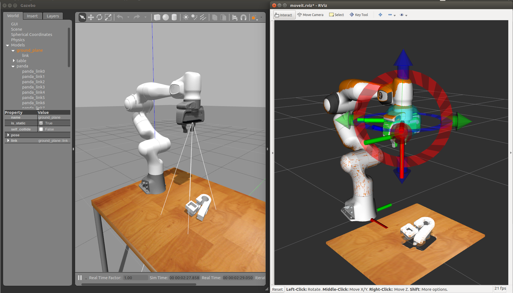

# Panda Simulation Environment (Gazebo + MoveIt!)

We placed a Franka Emika Panda Robot on a table in Gazebo and placed an object in front of it. The robot had a Realsense RS200 Camera attached to its wrist and a Panda Parallel Jaw Gripper. The Robot is controlled by MoveIt. 



## Installation

```
mkdir -p catkin_ws/src
cd catkin_ws/src
git clone https://github.com/SnehalD14/panda_simulation.git
git clone https://github.com/SnehalD14/panda_moveit_config.git
git clone --branch simulation https://github.com/SnehalD14/franka_ros.git
git clone --branch simulation https://github.com/SnehalD14/realsense_gazebo_plugin.git
cd ..
sudo apt-get install libboost-filesystem-dev
rosdep install --from-paths src --ignore-src -y --skip-keys libfranka
cd ..
```
It is also important that you build the *libfranka* library from source and pass its directory to *catkin_make*  when building this ROS package as described in [this tutorial](https://frankaemika.github.io/docs/installation.html#building-from-source).

Build the catkin workspace and run the simulation:
```
catkin_make -j4 -DCMAKE_BUILD_TYPE=Release -DFranka_DIR:PATH=/path/to/libfranka/build
source devel/setup.bash
roslaunch panda_simulation simulation.launch
```


## Spawning other objects 

The ```simulation.launch``` spawns the bar_clamp but you can spawn any objects in the workspace. To spawn an object from the ```objects``` folder, you can type the following command in a new terminal

```
rosrun gazebo_ros spawn_model -file `pwd`/strawberry.urdf -urdf -x 0.4 -y 0 -z 1.1 -model strawberry
```
where ```pwd``` stands for present working directory 

Replace the name of the urdf and the name of the model accordingly

## Acknowledgement 

This is a modified and extended version of the work done by [Erdal Pekel](https://github.com/erdalpekel/panda_simulation)
